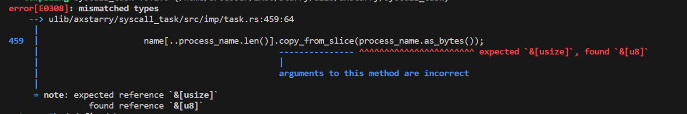

# 泉城实验室1月实习报告

感谢闭浩扬组长的悉心指导；感谢其他老师同学的帮助

## 1.2-1.8

学习了ArceOS的unikernel，对于单一特权级的操作系统有了全新认识，完成了练习1-5，
练习分别为：
>支持彩色打印、
>支持HashMap、
>修改内存分配算法、
>增加一个axdtb的模块组件、
>修改fifo算法通过ex5测试应用
练习了修改代码、不断检错纠错能力和熟悉了unikernel启动流程、单一特权级、单一应用、单一地址空间的操作系统的工作流程、练习一完成了axstd::println的修改、练习二：通过阅读标准库HashMap加以修改、练习三：实现earlyallocator的内存分配方法、修改协作式调度为抢占式调度运行ex5程序，
>实验一和二，将程序数据按照一定格式保存到app.bin文件中修改汇编指令，加载外部应用，实现app loader的外部应用加载器；
>实验三为公共ABI调用ArceOS功能，两个应用一个是nop、一个是wfi;
>实验四、实现sys_hello和sys_putchar、sys_terminate功能调用，通过std::process::exit退出ArceOS；
>实验五为改造应用hello_app，建立独立页表，把系统调用包装成函数，通过初始化和切换函数实现程序

## 1.9-1.15

学习Starry，并分析了ByteOS和Starry的操作系统syscall实现的异同，其中 
ByteOS的内核架构有一下特点：
>性能优化措施：文件树（加快文件检索）、写时复制（减少内存消耗）、延迟分配（MapArea结构进行内存存储、分配、减少了mmap带来的频繁申请和释放操作）、进程模板
>组合设计的思路：模块化设计打包驱动
>Rust无栈协程思想，轻量级线程
>支持GCC、Redis、http_server、simple_ssh
>ByteOS和Starry都是宏内核架构都采用了rcore的内核高半核设计、内核空间和用户空间分隔开、可以充分利用分割出的空间

Starry设计理念有以下特点：
>基于unikernel架构扩展的宏内核
>相较于unikernel的arceos，主要添加了axtask、trap异常处理、axhal等
>为了支持上面模块需要添加：地址空间、进程模块、文件系统、用户库等
>Feature中添加任务TaskInner成员中加入初始化trap上下文、子进程与父进程切换等信息，feature作用为选择不同的分支执行流
>在mmap映射文件时候也实现了lazy load功能，MapArea记录了多种功能

综合两种OS的syscall分析：
>Syscall功能实现过程都相似；ByteOS使用的是异步方式实现；Starry使用的同步方式实现，也实现了拥塞的处理；
>ByteOS使用封装的引用，Starry使用的指针

## 1.16-1.22

完成Starry的lab3实验··
第一步先修复网络问题 (该系统调用`FSTATAT`id为79，返回-64)查询后发现为`Machine is not on the network`，然后发现是路径获取时候stat函数出现了问题将其中的`if !real_path.ends_with("/") && !real_path.ends_with("include")`改为`if !real_path.ends_with("/") || !real_path.ends_with("include")` 根据文件系统中提供的`axfs::api::{metadata, path_exists, remove_dir, remove_file, rename}`方法处理old name和new name，其中还涉及到bin/elf中/的处理，对其中的`old_path`和`new_path`进行处理，最后确保ls正常输出

## 1.23-1.27

完成Prctl系统调用

### 本任务的主要目标
识别第一个参数信息(PR_GET_NAME编号为15)获取进程名称，并将进程名称存储在缓冲区中。

### 关于busybox的fork机制

实验第一步先进行进程名称的赋值

该方法为首先获取当前任务名称，执行操作时候为空
第一遍写的代码可以在内核直接执行，而不能在busybox中执行，原因是busybox执行程序是通过fork一个新程序来执行的，但原先代码中是创造一个新字符串，应该将其修改成获取任务名的字符串

### 处理并发情况

Busybox在fork出子程序后，会有并发程序的执行，这时候，需要对name的String进行包装，包装成UnsafeCell形式来处理并发情况，同样的，在操作时候需要通过get（）来获取可变引用

### Fork的时候复制的名字问题
如果fork时候直接复制名字，会出现busybox的输出，因为该程序是从busybox复制来的，那么应该做如下修改，保证复制的是fork出进程任务的名字

### 安全检查
第一步，不单单要检查指针是否为空，还需要检查地址是否被分配，通过这段代码实现
而且在下述代码在执行过程受到manual_alloc_for_lazy 来检查当前进程是否被正确分配，未分配不执行，以避免出发页面错误

### 关于name为何被限制到16字节
在学习了syscall系统调用linux规范，发现如果不限制长度，那么复制就是动态分配内存空间，增加系统负担。而内核需要在内核空间中预留一定长度来存放name

### 字符串规范
确保字符串以null为结尾，和c风格字符串类似。因为prctl 的 PR_GET_NAME 操作是传入一个缓冲区的指针，用于存储进程名称，需要在结尾加上null字符以确保字符串结果可以正确写入缓冲区中
将name按照/切分取最后一个

### 处理warning

### 枚举类型

>枚举类型使用numeric_enum_macro宏定义枚举类型：
>其中#[repr(usize)] 用于指定枚举的底层表示 
>#[allow(missing_docs)] 用于允许枚举成员缺失文档
>#[allow(non_camel_case_types)] 用于允许使用非驼峰式命名。 
>最后为枚举类型实现了“Eq, PartialEq, Debug, Copy, Clone”
>警告是应该采用驼峰命名法命名为PrOption
>程序优化在于减少了不必要的拷贝（类型“str”不实现“Clone” ）,优化了接口（&String）到（&str）
>使用try_from把uize转化为枚举类型，更加易于维护

